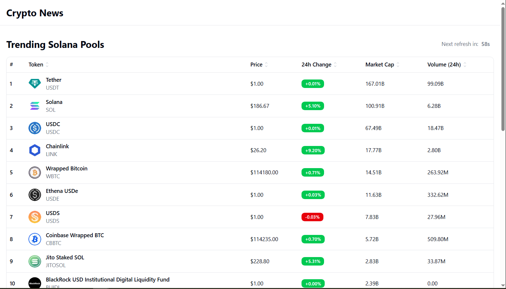
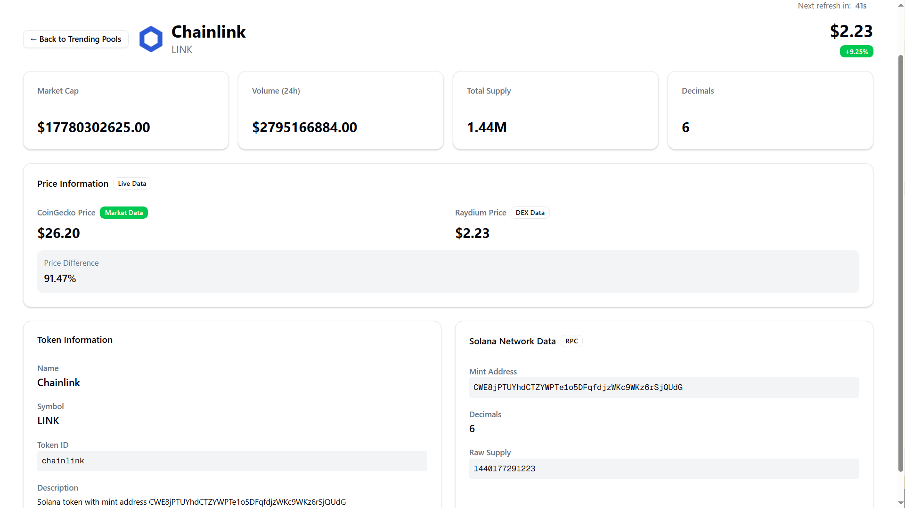

# Crypto News - Solana Token Tracker

##### A modern web application for tracking trending Solana tokens and pools with real-time data from multiple APIs.

**[Live Demo](https://solana-pulse-gules.vercel.app/)**





### Homepage - Trending Solana Pools

- Display of 25 trending Solana tokens from the CoinGecko API
- Real-time data table with sortable columns (Name, Price, 24h Change, Market Cap, Volume)
- Auto-refresh functionality with 60-second intervals
- Interactive sorting and filtering capabilities

## Technology Stack

- **Framework**: Next.js 15
- **Styling**: Tailwind CSS 4 with shadcn/ui components
- **State Management**: TanStack React Query
- **Blockchain Integration**: Solana Web3.js
- **Containerization**: Docker

### CoinGecko API

- Trending tokens and market data
- Built-in rate limiting and caching

### Raydium API

- Token prices and pool information
- Volume and liquidity metrics

### Solana RPC (QuikNode)

- Direct blockchain data access via QuikNode's optimized infrastructure
- Token metadata retrieval and account information
- Enhanced reliability and performance

## Architecture

### Component Structure

```
src/
├── app/                    # Next.js App Router pages
├── components/
│   ├── layout/            # Header and navigation components
│   ├── pages/             # Page-level components
│   ├── token-details/     # Token-specific UI components
│   ├── trending-pools/    # Pool table components
│   └── ui/               # Reusable UI components (shadcn/ui)
├── lib/
│   ├── api/              # API service layers
│   ├── context/          # React Context providers
│   ├── hooks/            # Custom React hooks
│   └── utils.ts          # Utility functions
└── types/                # TypeScript type definitions
```

### Prerequisites

- Node.js 18+ (Note: Some Solana dependencies require Node 20+)
- Docker and Docker Compose
- Git

### Local Development

```bash
# Clone the repository
git clone <repository-url>
cd crypto-news

# Install dependencies
npm install

# Start development server
npm run dev
```

### Docker Deployment

```bash
# Build and run with Docker Compose
docker-compose up --build

# Or build manually
docker build -t crypto-news .
docker run -p 3000:3000 crypto-news
```

The application will be available at `http://localhost:3000`

## Configuration

### Environment Variables

The application uses public APIs and doesn't require additional environment variables for basic functionality. The QuikNode RPC endpoint is configured in `src/lib/constants.ts`.
